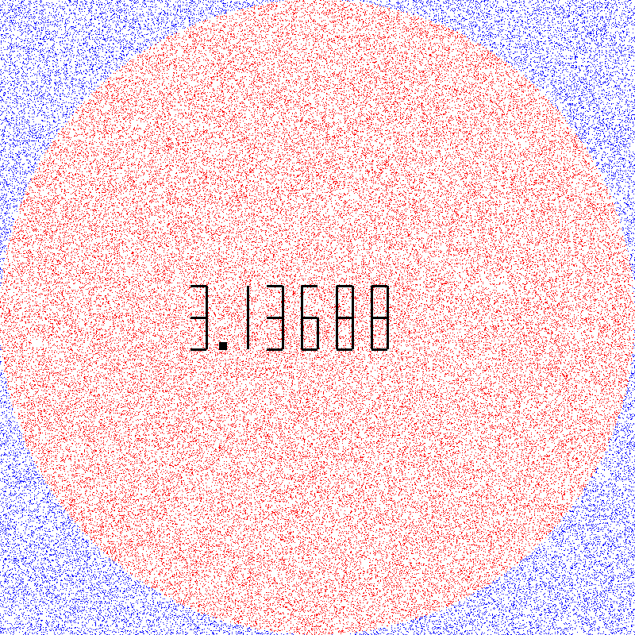

# Estimating Pi Using the Monte Carlo Method

## Overview
This project implements the Monte Carlo method to estimate the value of Pi by generating random points within a square of side length 2. The proportion of points that fall inside an inscribed circle is used to approximate the value of Pi.

In addition to calculating Pi, the project includes a script to visualize the distribution of points and generates images saved in the `images` directory.

## Project Structure
- `approximate_pi.py`: The main script that implements the Monte Carlo algorithm to calculate an approximation of Pi.
- `draw.py`: A script to visualize the distribution of the points generated by the algorithm and save the image in the `images` directory.
- `images/`: Directory where the generated images of the graphs are stored.

## Requirements
The project requires **Python 3.x** and the following external libraries for visualization and execution:

- `matplotlib`
- `numpy`

To install the dependencies, run:

```bash
pip install matplotlib numpy
```

## Usage

### 1. Calculating Pi and Visualizing Point Distribution
To calculate Pi and generate an image of the point distribution within a square and inscribed circle, use the following command:

```bash
python draw.py image_width number_of_points number_of_decimal_places
```

- `image_width`: Width of the output image in pixels.
- `number_of_points`: Total number of random points to generate.
- `number_of_decimal_places`: Number of decimal places to display in the Pi approximation.

The script will generate an image showing the points inside and outside the circle, which will be saved in the `images` directory.

### 2. Generated Files
- **Images**: The visualization of the Monte Carlo simulation will be saved as PNG files in the `images/` directory. These images will display the points distributed within the square and circle, demonstrating how the Monte Carlo method estimates Pi.

## Example Result
When running the script with 1,000,000 points, you should get an approximation of Pi close to its actual value (approximately 3.14159). The image file will clearly show points inside the circle (in green) and points outside the circle (in red).

Here is an example of the generated visualization:



## Contributions
Contributions are welcome! If you have suggestions for improvements, bug fixes, or additional features, feel free to open an issue or submit a pull request.
